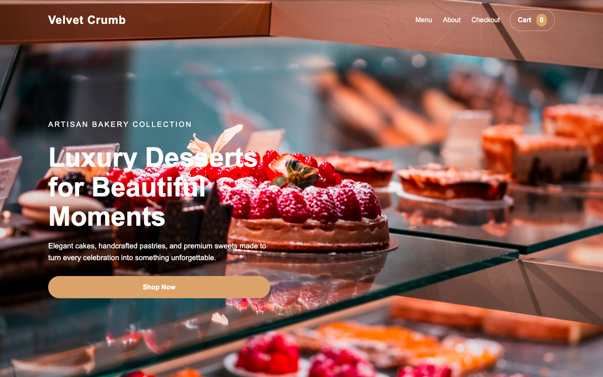

# 🍰 Velvet Crumb Bakery Website

A fully responsive bakery website featuring a modern UI, interactive shopping cart, and a custom checkout experience.

---

## 🚀 Live Demo

👉 [🔗 View Live Website](https://trinityray02.github.io/bakery-website/)

---

## 📸 Preview



---

## ✨ Features

- Responsive design (mobile, tablet, desktop)
- Interactive shopping cart using localStorage
- Add/remove items and adjust quantity
- Custom checkout page UI
- Cozy themed design with animations
- Mobile-friendly hamburger navigation menu
- Cute animated popup notifications when adding items to cart

---

## 🛠️ Tech Stack

- HTML5
- CSS3 (Flexbox + Grid)
- JavaScript (DOM manipulation, localStorage)

---

## 📁 Project Structure

- index.html
- checkout.html
- style.css
- script.js
- images/


---

## ▶️ How to Run Locally

1. Clone the repository:
   ```bash
   git clone https://github.com/trinityray02/bakery-website.git

2. Open the project folder
3. Double-click:
       index.html

👩‍💻 Author
Trinity Ray

⭐ Notes
This project was built as part of my journey into software development and showcases my ability to create responsive, interactive web applications using core web technologies.
